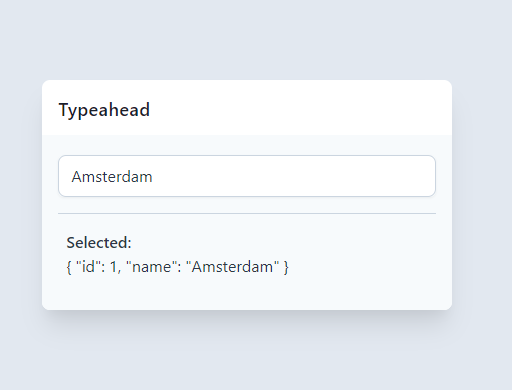

<!-- PROJECT LOGO -->
<br />
<p align="center">
  <a href="https://github.com/basarozcan/vue-tailwindcss-typeahead">
    
  </a>

  <h3 align="center">vue-tailwindcss-typeahead</h3>

  <p align="center">
    Just another vue&tailwind component that present you complete typeahead/autocomplete input.
    <br />
    <a href="https://github.com/basarozcan/vue-tailwindcss-typeahead"><strong>Explore the docs »</strong></a>
    <br />
    <br />
    <a href="https://codesandbox.io/s/vue-tailwindcss-typeahead-8qetk">View Demo on Codesandbox</a>
    ·
    <a href="https://github.com/basarozcan/vue-tailwindcss-typeahead/issues">Report Bug</a>
    ·
    <a href="https://github.com/basarozcan/vue-tailwindcss-typeahead/issues">Request Feature</a>
  </p>
</p>


<!-- TABLE OF CONTENTS -->
## Table of Contents

* [About the Project](#about-the-project)
  * [Built With](#built-with)
* [Getting Started](#getting-started)
  * [Installation](#installation)
* [Usage](#usage)
* [Roadmap](#roadmap)
* [Contributing](#contributing)
* [License](#license)
* [Contact](#contact)


<!-- ABOUT THE PROJECT -->
## About The Project
<p align="center">
  
</p>
I can't find any independent typeahead/autocomplete input component. All of them comes with UI libraries. 


### Built With

* Vue
* Tailwindcss

<!-- GETTING STARTED -->
## Getting Started

To get a local copy up and running follow these simple steps.

### Installation

1. Get package from npm
```sh
npm install vue-tailwindcss-typeahead
```


<!-- USAGE EXAMPLES -->
## Usage


### Call the component on parent
```javascript
<vue-tailwindcsscss-typeahead 
  :lists="list"
  @selected="selectedData"
  :ignoredList="selectedItemIds"
  :clearInputWhenClicked="false"
  :inputClass="['w-full','px-3','py-2','border','border-gray-400','rounded-lg','outline-none','focus:shadow-outline']"
  placeholder="Please write a city name">
  </vue-tailwindcsscss-typeahead>
```

### Code on parent component
```javascript
<script>
  import Vue from 'vue';
  import VueTailwindcssTypeahead from '@/vue-tailwindcsscss-typeahead.vue';

  export default Vue.extend({
    name: 'ParentComponent',
    components: {
      VueTailwindcssTypeahead
    },
    data() {
      return {
        list: [
          {
            id: 1,
            name: "Amsterdam",
          },
          {
            id: 2,
            name: "Berlin",
          },
          {
            id: 3,
            name: "Istanbul",
          },
        ],
        selectedItemIds: [],
        selectedItem: null
      };
    },
    methods: {
      selectedData(value) {
        this.selectedItem = value
      },
    },
  });
</script>
```

### Properties
| props                 | description                                                                                                   | Type    |
|-----------------------|---------------------------------------------------------------------------------------------------------------|---------|
| lists                 | pass an array of data. id and name attribute must be passed                                                   | Array   |
| ignoredList           | selected item's id will be passed to this variable and this item will not be showed if user want to change it | Array   |
| clearInoutWhenClicked | If this is set to true, input will be cleared after selection. Best for multiple selections                   | Boolean |
| inputClass            | Tailwindcss classes can be passed to change input's class                                                     | Array   |
| placeholder           | placeholder text for input                                                                                    | String  |
| @selected             | point method on parent component for custom operations                                                        |         |


<!-- ROADMAP -->
## Roadmap

See the [open issues](https://github.com/basarozcan/vue-tailwindcss-typeahead/issues) for a list of proposed features (and known issues).


<!-- CONTRIBUTING -->
## Contributing

Contributions are what make the open source community such an amazing place to be learn, inspire, and create. Any contributions you make are **greatly appreciated**.

1. Fork the Project
2. Create your Feature Branch (`git checkout -b feature/AmazingFeature`)
3. Commit your Changes (`git commit -m 'Add some AmazingFeature'`)
4. Push to the Branch (`git push origin feature/AmazingFeature`)
5. Open a Pull Request


<!-- LICENSE -->
## License

Distributed under the MIT License. See `LICENSE` for more information.


<!-- CONTACT -->
## Contact

Twitter - [@basarozcan](https://twitter.com/basarozcan)

